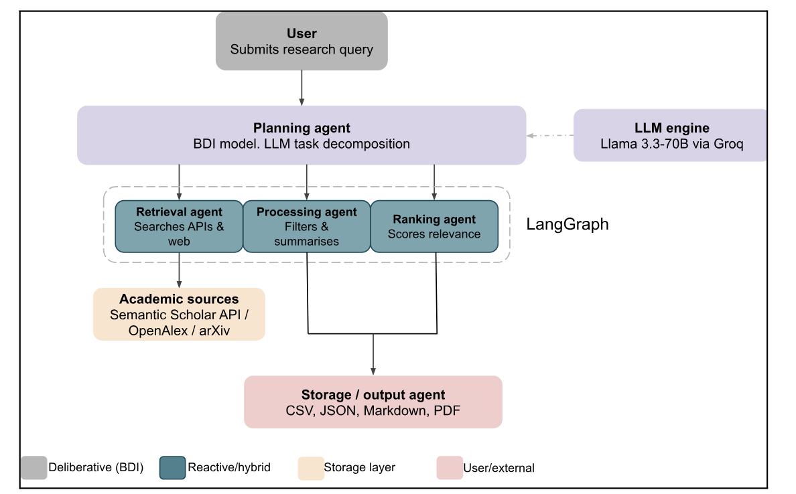

# Team Project: ResearchMate

## Project Overview

ResearchMate was a collaborative project focused on designing an intelligent multi-agent system to support students with academic research planning.

The proposed system was intended to help users develop and align a research topic, aim, objectives, research questions and methodology through a sequence of specialised agent functions.

## Team Members

- Frank Ademoye
- Alix
- Mosleh
- Hamad

## My Individual Contribution

My contribution included:

- participating in virtual team meetings and design discussions;
- researching intelligent-agent and multi-agent approaches;
- contributing to the definition of the ResearchMate workflow;
- reviewing how planning, retrieval, processing and output functions could interact;
- contributing to project documentation and presentation preparation;
- participating in peer-review activity;
- helping distinguish the proposed user journey from the technical agent workflow.

These contributions should be supported by meeting notes, shared documents, presentation material and peer-review evidence.

## System Design

The group considered a hybrid multi-agent architecture in which specialised agents or components would perform distinct tasks.

These included:

- planning;
- information retrieval;
- processing;
- analysis;
- output generation.

The intention was for these functions to work together to transform an initial research idea into a structured academic research plan.

## ResearchMate Architecture and Design Evidence

The diagram below shows the proposed ResearchMate hybrid multi-agent architecture developed as part of the group project.

The Planning Agent uses a deliberative BDI approach to decompose the user’s research query. Retrieval, Processing and Ranking agents perform specialist functions, while LangGraph coordinates the workflow. The Storage/Output Agent prepares the final results.

## Tools and Technologies Considered

The group considered:

- Python;
- large language models;
- CrewAI;
- LangChain;
- vector databases;
- GitHub;
- modular agent architecture.

Not all of these technologies were implemented. Some were researched or proposed during the design stage, while the later individual prototype used a more focused modular Python structure.

## Teamwork and Collaboration

The project required virtual teamwork, communication, shared decision-making and the allocation of responsibilities.

The team discussed:

- project scope;
- intended users;
- system architecture;
- agent responsibilities;
- technologies;
- presentation structure;
- division of tasks.

## Challenges

One challenge was agreeing a realistic project scope. The initial concept was broad and included several specialist agents, retrieval capabilities and a more advanced interface.

A second challenge was coordinating work across a virtual team. When responsibilities were not always documented clearly, it became harder to track ownership and progress.

Time management was also important because the group needed to balance technical ambition with the assessment deadline.

These challenges showed me that virtual development work requires clear roles, written decisions, action tracking and regular progress reviews.

## What I Learned

The project helped me understand that successful multi-agent development depends on both technical design and effective team organisation.

I learned the importance of:

- agreeing clear roles;
- documenting decisions;
- setting realistic scope;
- tracking actions;
- communicating regularly;
- distinguishing collaborative work from individual ownership.

## Distinction Between Group and Individual Work

ResearchMate was developed as a collaborative group concept.

The Week 11 implementation presented elsewhere in this portfolio was my individual prototype. The group project informed my understanding of the problem, architecture and user journey, while the individual coding, testing and implementation evidence were completed separately.

## Connection to Learning Outcomes

The project supported:

- Learning Outcome 1 through analysis of agent architectures and approaches;
- Learning Outcome 2 through application of agent techniques to academic research planning;
- Learning Outcome 3 through consideration of appropriate tools, technical limitations and ethical risks;
- Learning Outcome 4 through virtual teamwork, communication and shared project organisation.

## Evidence

- [Team meeting notes](team-meetings.html)
- [Week 7 system design](week-7-design.html)
- [Week 11 individual implementation](week-11-implementation.html)
- ResearchMate architecture diagram
- Group presentation
- Peer-review evidence
- Shared planning documents
- Group communication screenshots
