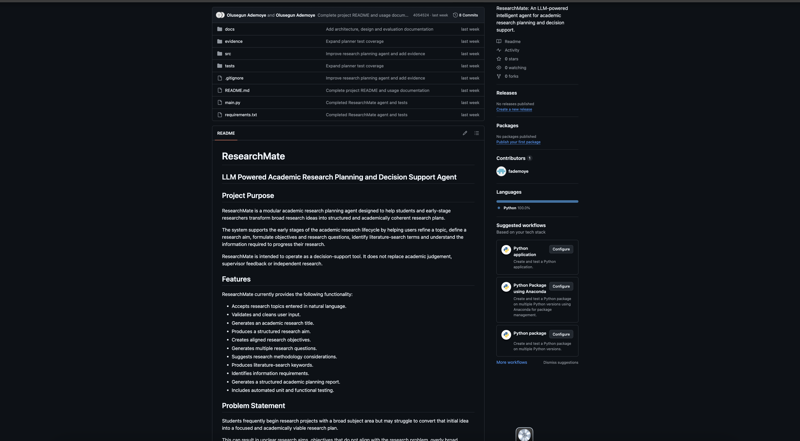

# Week 11 Final Implementation

## Project Overview

The Week 11 implementation was an individual intelligent-agent project focused on academic research planning.

The system was designed to help postgraduate students organise an initial research topic into a structured plan containing:

- a research aim;
- research objectives;
- research questions;
- methodology suggestions;
- a clearly presented final output.

The implementation developed from the wider ResearchMate concept explored during the group project, but the coding, testing and final implementation presented on this page were completed as my individual work.

## Problem Being Addressed

Students can find it difficult to align their research topic, aim, objectives, research questions and methodology.

The system was therefore designed to provide structured guidance that could help users develop a more coherent initial research plan.

The system was intended to support academic thinking rather than replace independent research, academic literature or supervisor guidance.

## Final System Architecture

The final implementation used a modular Python structure.

The main components included:

- `main.py` – started the application and managed the command-line interaction;
- `agent.py` – coordinated the overall research-planning workflow;
- `planner.py` – developed the structure of the research plan;
- `retriever.py` – provided simplified retrieval functionality within the prototype;
- `processor.py` – processed the user input and intermediate information;
- `output_generator.py` – produced the final structured output;
- test files – assessed key components and the overall workflow.

The final implementation used agent-inspired modular components coordinated through a defined workflow. It did not implement fully independent agents with autonomous communication and decision-making.

## Final Workflow

1. The user entered a research topic.
2. The system processed and validated the input.
3. The planning component identified the required research elements.
4. The coordinating component directed the relevant modules.
5. The system generated a research aim, objectives, questions and methodology suggestion.
6. The structured research plan was displayed to the user for review.

## Technologies Used

The final implementation used:

- Python;
- GitHub;
- modular programming;
- pytest;
- command-line interaction;
- structured output generation.

## GitHub Repository

The individual GitHub repository provides access to the final source code, modular project structure, testing files and technical documentation.

[View the individual implementation on GitHub](PASTE-YOUR-INDIVIDUAL-REPOSITORY-LINK-HERE)

## Code Structure

The project was separated into different modules rather than placing all functionality in one large script.

This improved:

- readability;
- maintainability;
- testability;
- separation of responsibilities;
- future extensibility.

Separating the planner, processor, retriever and output-generation functions also made it easier to identify errors and test individual components.

## Testing

The system was tested using unit and functional tests.

The tests checked:

- whether the planning component produced the expected structure;
- whether the overall workflow operated correctly;
- whether the final output contained the required research-planning elements.

Three tests were collected and all three passed successfully.

Passing the tests increased confidence that the technical workflow operated as intended. However, the tests did not prove that every generated recommendation was academically accurate, relevant or appropriate.

Further evaluation would be required to assess:

- the alignment between the aim, objectives and questions;
- the suitability of the suggested methodology;
- consistency across different research topics;
- usefulness to postgraduate students;
- feedback from academic supervisors.

## Example Output

The following example shows the type of structured research plan produced by the system.

**Research Topic:**  
[Insert the exact topic used in your real system test.]

**Research Aim:**  
[Insert the research aim generated by your system.]

**Research Objectives:**

1. [Insert the first generated objective.]
2. [Insert the second generated objective.]
3. [Insert the third generated objective.]

**Research Questions:**

1. [Insert the first generated research question.]
2. [Insert the second generated research question.]
3. [Insert the third generated research question, where applicable.]

**Suggested Methodology:**  
[Insert the methodology recommendation generated by your system.]

Replace this example with one genuine output produced by the final implementation.

## Implementation Evidence

### System Running

[Open the system-running screenshot](evidence/implementation/system-running.png)

### User Input

[Open the user-input screenshot](evidence/implementation/user-input.png)

### Generated Output

[Open the generated-output screenshot](evidence/implementation/generated-output.png)

### Project Structure

[Open the project-structure screenshot](evidence/implementation/project-structure.png)

### Testing Evidence

[Open the pytest-results screenshot](evidence/implementation/pytest-passed.png)
## Presentation Evidence

The individual presentation was submitted separately from the code repository. It summarised the project problem, architecture, implementation, testing, limitations and future improvements.

[View the presentation slides](PASTE-YOUR-PRESENTATION-LINK-HERE)

[Read the presentation transcript](PASTE-YOUR-TRANSCRIPT-LINK-HERE)

Remove these links if the presentation and transcript are not being uploaded to the e-portfolio.

## Limitations

The final implementation was a functional prototype rather than a production-ready academic-support system.

Its main limitations included:

- the quality of the output depended on the quality and detail of the user input;
- live academic-database retrieval and complete source verification were not implemented;
- the system could not guarantee that every aim, objective, question or methodology recommendation was academically appropriate;
- testing focused mainly on technical functionality rather than educational quality;
- the command-line interface was less accessible for non-technical users;
- the system did not provide detailed explanations for every recommendation;
- further testing with students and academic supervisors would be required;
- additional privacy, security and responsible-use safeguards would be needed before deployment.

These limitations mean that users would still need to verify the output against academic literature, university requirements and supervisor feedback.

## Ethical and Professional Considerations

The system could generate plausible recommendations that appeared authoritative even when they required further academic verification.

This created risks relating to:

- inaccurate or unsupported guidance;
- student overreliance;
- bias in methodology recommendations;
- weak explainability;
- privacy and data protection;
- academic-integrity concerns.

The system was therefore positioned as a support tool rather than an authoritative academic adviser.

A responsibly deployed version would require:

- academic-source verification;
- clear user warnings;
- explanations for major recommendations;
- human review;
- privacy safeguards;
- monitoring of unsuitable outputs;
- appropriate handling of user data.

## What I Learned

The implementation strengthened my understanding of modular Python development.

Separating the planner, processor, retriever, coordinating agent and output generator made the system easier to understand, maintain and test.

I also developed a stronger practical understanding of intelligent-agent design. I learned that an agent-based system requires clearly defined responsibilities and coordination between components, rather than simply dividing code into several files.

Testing and debugging helped me recognise the difference between technical correctness and output quality. A system can execute successfully while still producing academic guidance that needs human review and source verification.

The project also improved my project-scoping skills. The original ResearchMate concept was broader than the final implementation, so I prioritised the core research-planning workflow that could be completed and tested within the available timeframe.

Finally, the project increased my awareness of responsible AI development. Academic-support systems should be transparent about their limitations and should support rather than replace human judgement.

## Connection to Learning Outcomes

### Learning Outcome 1

The implementation supported my ability to analyse agent-based architectures by allowing me to compare the broader Week 7 multi-agent design with the more focused modular Week 11 prototype.

### Learning Outcome 2

The system applied intelligent-agent techniques to the real-world problem of helping postgraduate students align their research topic, aim, objectives, research questions and methodology.

The evaluation also considered technical risk and uncertainty, including input quality, source verification and output reliability.

### Learning Outcome 3

I used Python, GitHub, modular software design and pytest to design, implement and evaluate the prototype.

I also considered legal, social, ethical and professional issues, including privacy, academic integrity, bias, explainability, data reliability and responsible deployment.

### Learning Outcome 4

Although the final implementation was completed individually, it developed from the wider ResearchMate group project.

The process strengthened my understanding of virtual teamwork, project ownership, role allocation, documentation and the distinction between collaborative and individual contributions.
